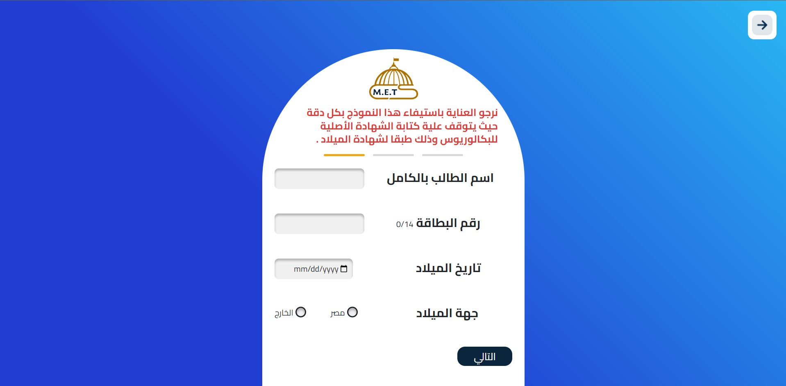
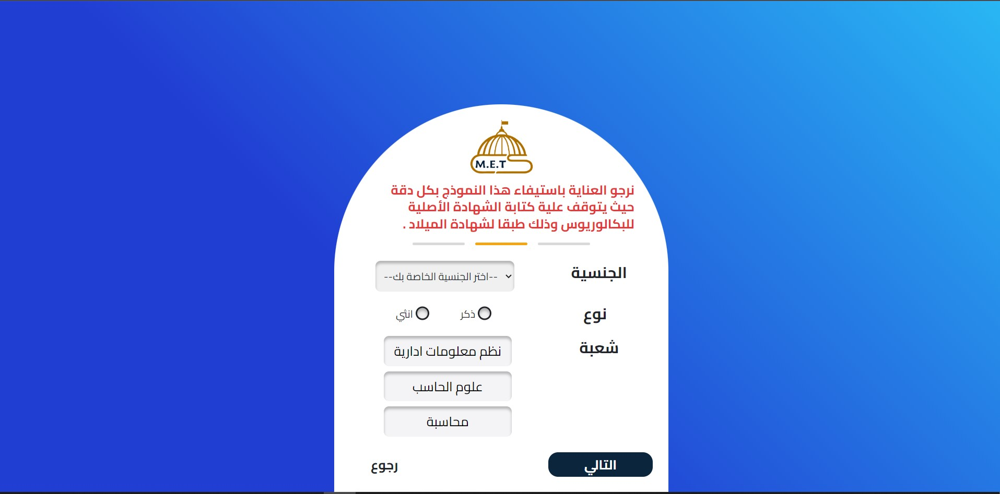
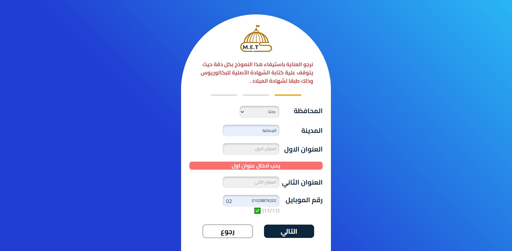
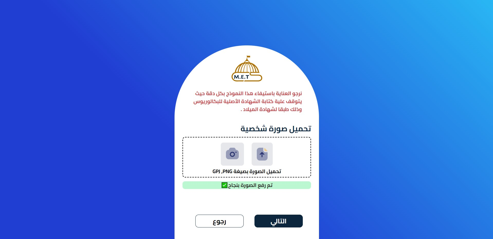
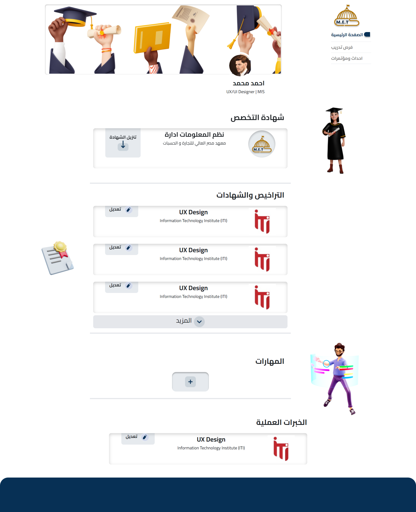
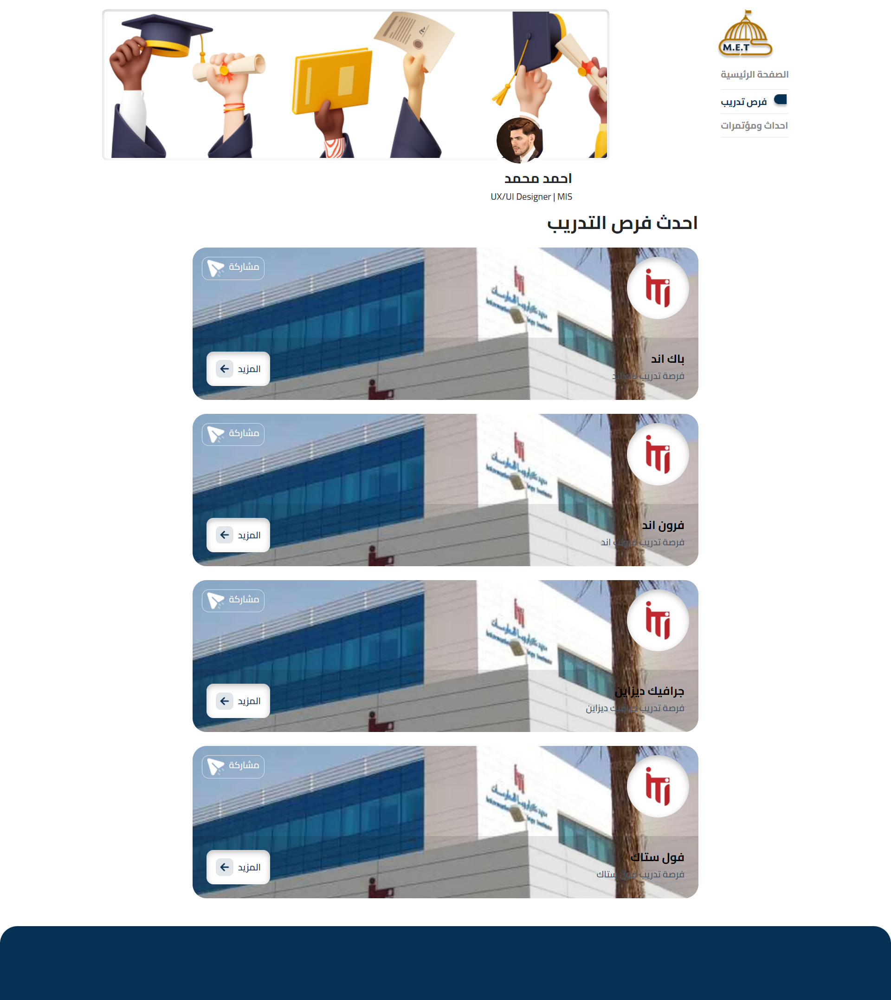

<h1>ALUMNI</h1>
<h5>Alumni project for the Egyptian Higher Institute of Trade and Computers in Mansoura.</h5>

<h4>Application features✨✨:</h4>
<ul>
    <li>SignIn.</li>
    <li>A special page for each graduate.</li>
    <li>Request a graduation certificate through the application.</li>
    <li>View and add licenses and certificates obtained by the graduate.</li>
    <li>Display and add skills to the graduate.</li>
    <li>Displaying and adding the currency experiences that the graduate obtained and will obtain in the future.</li> 
    <li>A full page to announce the available trainings at the present time and the possibility of sharing them with others and applying for them.</li>
    <li>Cooperation with some technology institutes such as ITI and others.</li>
    <li>The application supports the <b>PWA</b> feature, so you can download it on the mobile phone through the browser..</li>
</ul>

<h4>Steps to enter the data to request the certificate.</h4>
<table>
  <thead>
    <tr>
      <th>Step 1</th>
      <th>Step 2</th>
      <th>Step 3</th>
      <th>Step 4</th>
      <th>Step 5</th>
    </tr>
  </thead>
  <tbody>
    <tr>
      <th width="600px"></th>
      <th width="600px"></th>
      <th width="600px"></th>
      <th width="600px"></th>
      <th width="600px"></th>
    </tr>
  </tbody>
  <tfoot>
    <tr>
      <th>Step 1</th>
      <th>Step 2</th>
      <th>Step 3</th>
      <th>Step 4</th>
      <th>Step 5</th>
    </tr>
  </tfoot>
</table>
<h3>Alumni page:</h3>

<h3>Show exercises page:</h3>

